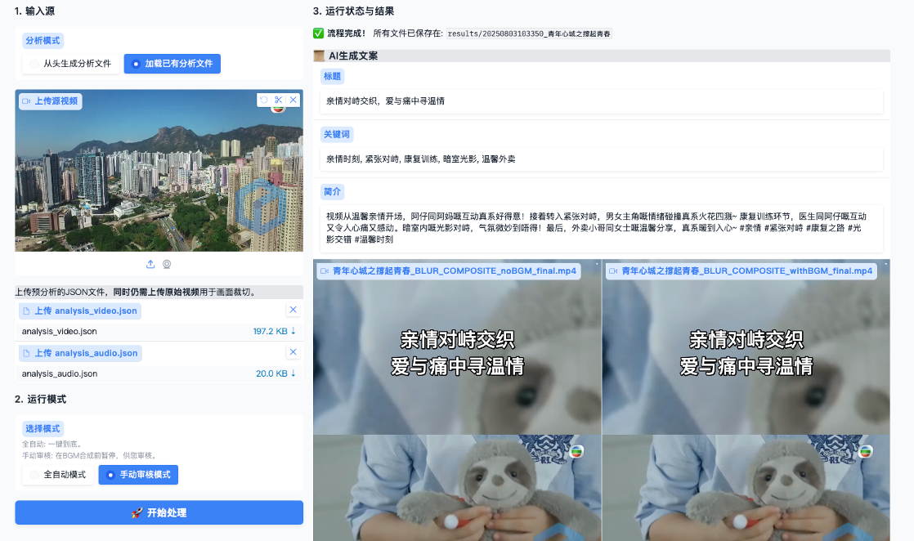
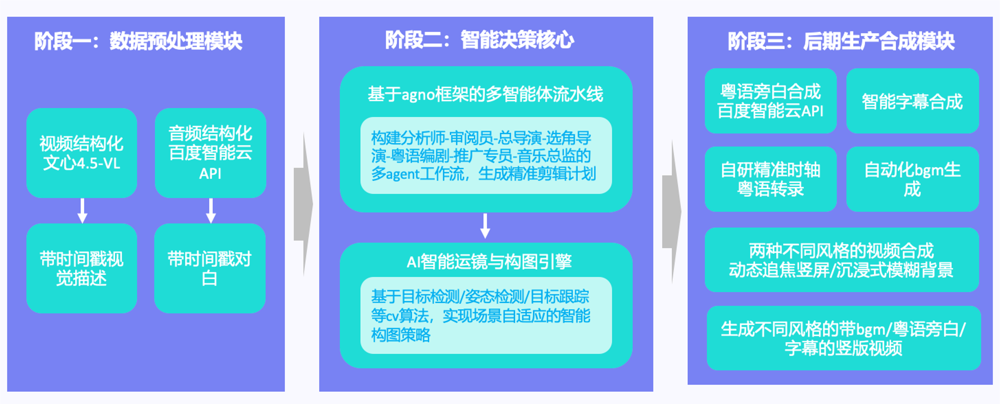

# AI 粤语短视频全自动生成器

[](https://www.python.org/downloads/)
[](https://opensource.org/licenses/MIT)

这是一个专为**粤语内容**设计的端到端自动化工作流，能将任何包含粤语对话的长视频（如港剧、访谈、生活Vlog）智能地转化为引人入胜的、带有**地道粤语旁白**的竖屏短视频。它利用多模态大语言模型和 Agent 工作流，实现了从内容理解、智能编排、旁白创作到成品输出的全自动化。


  


---

## ✨ 核心功能

*   **🤖 AI 智能分析**: 结合 Vision LLM 逐帧理解视频画面和 ASR 识别粤语语音，生成详细的时序内容描述。
*   **📝 Agent 编排工作流**: 基于 `agno` 框架，通过模拟“分析师”、“总导演”、“剧本作家”等多个 AI Agent 的协作，完成从筛选精华片段、规划故事线到创作旁白的全过程。
*   **🎭 地道粤语旁白创作**: 这是项目的核心亮点。AI 能根据视频内容确定核心主角，并以其第一人称视角，创作出**符合人物性格、口吻地道**的粤语旁白，极大增强了视频的亲切感与代入感。
*   **🎥 智能运镜系统**: 利用 YOLO Pose 模型识别人体姿态，自动实现对焦主角、平滑运镜（Ken Burns 效果），将横屏画面智能裁切为富有动感的竖屏视频。
*   **🎵 自动 BGM 与字幕**: AI 根据视频主题自动推荐并下载合适的背景音乐，并为旁白生成时间轴精准的 SRT 字幕，最终一键式烧录到视频中。
*   **🌐 Gradio Web UI**: 提供友好的图形化界面，用户只需上传视频、配置 API，即可一键启动整个工作流。支持“全自动”和“手动审核”两种模式。

## 🌊 工作流图解

项目的工作流被划分为几个核心阶段，协同完成视频的创作：
  


---

## 🛠️ 环境准备与安装

在开始之前，请确保您的系统满足以下先决条件。

### 1. 系统依赖

- **Python**：3.7 或更高版本。
- **FFmpeg**：项目严重依赖 `ffmpeg` 进行音视频处理和字幕烧录。请确保已在您的系统中安装并将其添加至系统环境变量（PATH）。
  - **Windows**：可从 ffmpeg.org 下载，解压后将 `bin` 目录路径添加到环境变量。
  - **macOS**：使用 Homebrew:
    ```bash
    brew install ffmpeg
    ```
  - **Linux**：
    ```bash
    sudo apt update && sudo apt install ffmpeg
    ```

### 2. 安装步骤

#### 克隆仓库
```bash
git clone https://github.com/your-username/ai-short-video-generator.git
cd ai-short-video-generator
```

#### 创建并激活虚拟环境（推荐）
```bash
# Windows
python -m venv venv
.env\Scriptsctivate

# macOS / Linux
python -m venv venv
source venv/bin/activate
```

#### 安装 Python 依赖
项目所需的所有库都已在 `requirements.txt` 中列出。
```bash
pip install -r requirements.txt
```

### 下载所需模型

- **姿态识别模型 (YOLO)**：项目需要一个 YOLO Pose 模型来进行智能运镜。请下载一个 .pt 模型文件（如 `yolov8n-pose.pt` 或 `yolo11m-pose.pt`），并将其放置在项目根目录，或在 `config.py` 中指定其正确路径。
- **字体文件**：项目默认使用 `霞鹜文楷bold.ttf` 字体进行字幕烧录。请确保 `fonts/` 目录下存在此文件，或替换为您自己的字体文件并在 `burn_subtitles.sh` 中更新。

### 配置 API 密钥

这是最关键的一步。 `config.py`需要填入您自己的 API 凭证。

`config.py` 文件中应包含：

- `VIDEO_LLM_*`: 视觉分析大模型（支持 OpenAI API 格式，如百度千帆、Ollama 等）。用于理解视频帧。
- `AGENT_LLM_*`: Agent 工作流大模型（支持 OpenAI API 格式）。用于内容创作和规划。
- `BAIDU_TTS_*`: 百度语音合成 TTS。用于生成旁白。请前往百度AI开放平台申请。
- `MODEL_PATH`: 指向您下载的 YOLO 姿态模型文件路径。

---

## 🚀 快速开始

### 启动 Gradio 应用

确保您的虚拟环境已激活，然后在项目根目录运行：

```bash
python app.py
```

应用启动后，浏览器会自动打开 http://127.0.0.1:7860。

### 配置参数

在 Web UI 的 “⚙️ 参数配置” 标签页中，检查所有 API 和模型路径是否正确。强烈建议点击每个配置项下方的 “测试连接” 按钮，确保所有服务都可正常访问。

### 运行主工作流

- 切换到 “🚀 主工作流” 标签页。
- 上传视频：上传您想要处理的长视频文件。
- 选择分析模式：
  - **从头生成分析文件**：首次处理视频时选择此项（完整分析，耗时较长）。
  - **加载已有分析文件**：如果您之前分析过同一视频，并保留了生成的 `analysis_video.json` 和 `analysis_audio.json`，可选择此项以跳过耗时的分析步骤。
- 选择运行模式：
  - **全自动模式**：一键到底，自动完成所有步骤，包括 BGM 的下载和合成。
  - **手动审核模式**：流程将在生成旁白和下载 BGM 后暂停，您可以试听旁白，并选择使用 AI 下载的 BGM 或上传自己的 BGM，然后手动点击继续。
- 点击 “🚀 开始处理” 按钮。右侧的状态面板将实时显示当前进度。

### 查看结果

流程完成后，右侧将显示 AI 生成的标题、关键词和简介。下方将出现最终生成的短视频播放器，可以直接播放并下载。所有产物（包括日志、中间文件和最终视频）都保存在 `results/` 目录下，并按运行时间戳命名。

---

## 📁 项目文件结构

```text
.
├── app.py                  # Gradio UI 和主应用逻辑
├── config.py               # 配置文件 (API密钥, 模型路径等)
├── requirements.txt        # Python 依赖列表
├── README.md               # 本文档
├── fonts/                  # 字体文件夹
│   └── 霞鹜文楷bold.ttf
├── src/                    # 核心源代码目录
│   ├── pre_analyzer.py     # 视频/音频预分析模块
│   ├── data_manager.py     # 结构化数据管理
│   ├── main_workflow.py    # AI Agent 工作流定义
│   ├── tools.py            # Agent 可用工具
│   ├── video_processor.py  # 智能视频处理与运镜
│   ├── audio_processor.py  # 音频(TTS)处理
│   ├── sub_fixer.py        # 字幕格式化
│   ├── bgm_downloader.py   # BGM 下载模块
│   ├── final_assembler.py  # 最终视频/音频合成
│   └── burn_subtitles.sh   # FFMPEG 字幕烧录脚本
└── results/                # 输出目录，所有运行结果在此
```

---

## 📜 License

This project is licensed under the MIT License. See the [LICENSE](./LICENSE) file for details.
